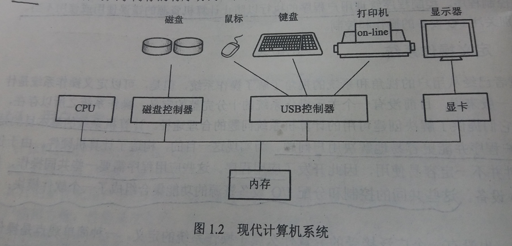

### 1.2 计算机系统组织
---
#### 1.2.1 计算机系统操作

- 现代计算机系统
    - 现代通用计算机系统由一个或多个CPU和若干设备控制器通过共同的总线相连而成
    - 该总线通过了对共享内存的访问
    - 每个设备控制器负责一种特定类型的设备
    - CPU与设备控制器可以并发工作，并竞争内存周期
    - 为了确保对共享内存的有序访问，需要内存控制器来协调对内存的访问
    - 如图
    

- 计算机如何启动
    - 计算机启动的第一步，需要先运行一个引导程序(bootstrap program)
    - 此引导程序初始化系统中的所有部分，包括CPU寄存器、设备寄存器和内存内容
    - 然后引导程序定位操作系统内核并将它装入内存

- 中断
    - 中断是指计算机运行过程中，发生了某个事件，CPU停止并保存当前运行的程序，并处理此事件，处理完毕后继续运行停止的程序的过程
    - 中断的三种类型
        - 中断
            - 由CPU外部引起
            - 如I/O中断、时钟中断、控制台中断等
        - 异常
            - 来自CPU的内部事件或程序执行中的事件引起
            - 如由于CPU本身故障（电源电压低于105V或频率在47～63Hz之外）、程序故障（非法操作码、地址越界、浮点溢出等）等引起的过程
        - 陷阱
            - 由于在程序中使用了请求系统服务的系统调用而引发的过程
            - 前两类的产生往往是无意、被动的，而陷阱是有意和主动的
    - 基本中断工作机制
        - CPU硬件有一条中断请求线(Interrupt-request line,IRL)
        - CPU在执行完每条指令后，都会检测IRL
        - 当CPU检测到已有控制器通过中断请求线发送了信号，CPU将保存当前状态并跳转到内存固定位置的中断处理程序
        - 中断处理程序判断中断原因，进行必要的处理，重新恢复状态，最后执行中断返回指令以便CPU返回中断以前的执行状态
---
#### 1.2.2 存储结构

- 内存
    - 内存是处理器可以直接访问的唯一的大容量存储区域
    - 支持随机访问
    - 内存是易失性存储设备，断电会丢失所有内容

- 典型指令执行周期
    1. 从内存中获取指令，并保存在指令寄存器中
    2. 指令被解码，并可能导致从内存中获取操作数或将操作数保存在内部寄存器
    3. 计算
    4. 当指令完成对操作数的执行后，其结果可以存回到内存

- 外存(辅存,secondary storage)
    - 永久地存储大量的数据
    - 最常见的外存是磁盘
---
#### 1.2.3 IO结构

- 在计算机中，存储器只是众多IO设备中的一种

- 现代通用计算机系统由一个或多个CPU和若干设备控制器通过共同的总线相连而成

- 每个设备控制器负责一种特定类型的设备

- 设备控制器负责在其所控制的外部设备与本地缓冲存储之间进行数据传递

- 通常，操作系统为每个设备控制器提供一个设备驱动程序，来提供一些统一的接口函数

- 对于大块数据的移动，可以使用直接内存访问(DMA)控制器
---
copyleft ! 2018 T0UGH. All rights reserved under the MIT license.