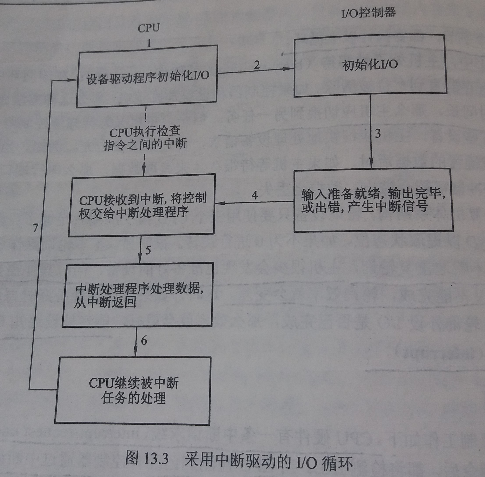

### 13.2 IO硬件
---
- 计算机的设备
    - 存储设备：如磁盘、磁带
    - 传输设备：如网卡、medem
    - 人机交互设备：如屏幕、键盘、鼠标

- 端口：设备与计算机通信所用的连接点

- 总线（bus）
    - 一个或多个设备使用的一组共同的线
    - 和一组严格定义的可以描述在线上传输信息的协议 

- 控制器（controller）
    - 用来操作端口、总线或设备的一组电子器件

- 处理器如何向控制器发送命令和数据以完成IO传输
    - 控制器有一个或多个用于数据和控制信号的寄存器
    - 处理器通过读写这些寄存器的位模式来与控制器通信
        1. 通过使用特殊IO指令来想指定的IO端口地址传输一个字节或字
        2. 设备控制器也可支持内存映射IO
        - 内存映射要比发送指令快，但是容易收到意外修改

- IO端口通常有4种寄存器
    - 数据输入寄存器：被主机读出以获得数据
    - 数据输出寄存器：被主机写入以发送数据
    - 状态寄存器
        - 包含一些主机可读取的位
        - 这些位指示各种状态
        - 例如当前任务是否完成，数据输入寄存器中是否有数据可以读取，是否出现设备故障
    - 控制寄存器
        - 被主机用来向设备发送命令或改变设备状态
---
#### 13.2.1 轮询
- 所需寄存器
    - 状态寄存器
        - 通过状态寄存器的 **忙位**(busy bit) 来显示其状态
        - 控制器工作忙时就置忙位，可以接受下一命令时就清忙位
    - 命令寄存器
        - 主机通过命令寄存器中命令就绪位来表示其意愿
        - 当主机有命令需要控制器执行时，就置命令就绪位

- 对每个需要输出的字节执行下面的循环
    1. 主句不断读取忙位，直到该位被清除
    2. 主机设置命令寄存器中的写位并向数据输出寄存器中写入一个字节
    3. 主机设置命令就绪位
    4. 当控制器注意到命令就绪位已被设置，则设置忙位
    5. 控制器读取命令寄存器，并看到写命令。它从数据输出寄存器中读取一个字节，并向设备执行IO操作
    6. 控制器清除命令就绪位，清除状态寄存器的故障位表示设备IO成功，清除忙位表示完成

- 轮询会使CPU处于忙等状态，效率太低
---
#### 13.2.2 中断

- 基本中断工作机制
    - CPU硬件有一条中断请求线(Interrupt-request line,IRL)
    - CPU在执行完每条指令后，都会检测IRL
    - 当CPU检测到已有控制器通过中断请求线发送了信号，CPU将保存当前状态并跳转到内存固定位置的中断处理程序
    - 中断处理程序判断中断原因，进行必要的处理，重新恢复状态，最后执行中断返回指令以便CPU返回中断以前的执行状态
    - 如图
    

- 其他需要提供的中断处理特性
    1. 在进行关键处理时，能够延迟中断程序
        - CPU有两个中断请求线
            - 非屏蔽中断
            - 可屏蔽中断：由CPU在执行关键的不可中断的指令序列前加以屏蔽
    2. 更为有效地将中断分发到合适的中断处理程序，而不是检查所有设备以决定哪个设备引起中断
        - 中断机制接受一个地址，以用来从一小集合内选择特定的中断处理程序
        - 这个地址是一个称为中断向量的表中偏移量，该向量包含了特殊中断处理程序的内存地址
    3. 需要多级中断，使操作系统能区分高优先级或低优先级的中断

- 触发中断的事件都是会导致CPU去执行一个紧迫的自我独立的程序的事件

- 中断是能够保存处理器的状态并能调用内核中的特权程序的高效软件和硬件机制

- 中断的用途
    - 处理IO设备的输出完成、输入数据已准备好或检测到错误
    - 处理各种异常，如被0除、访问一个被保护的内存地址
    - 处理页错误
    - 系统调用
        1. 一个程序使用库调用来执行系统调用
        2. 库程序检查应用程序所给的参数，建立一个数据结构将参数传递给内核，并执行一个称为软中断或陷阱指令的特殊指令
        3. 该指令有一个参数用来标志所需要的内核服务
        4. 当系统调用执行陷阱指令时，中断硬件会保存用户代码的状态
        5. 然后切换到内核模式，分派到实现所请求服务的内核程序
---
#### 13.2.3 直接内存访问

- 程序控制IO(Programed IO,PIO)：使用通用处理器观察状态位并按字节向控制器寄存器送入数据

- 直接内存访问(direct-memory access,DMA)：计算机为了避免用PIO增加CPU的负担，将一部分任务下放给一个专业处理器---DMA控制器

- CPU向DMA控制器发送指令后，就可以继续其他工作

- DMA控制器和设备控制器之间的握手
    - 通过一对称为DMA-request和DMA-acknowledge的线来进行
    - 当有数据需要传输时，设备控制器通过DMA-request线发送信号
    - 该信号导致DMA控制器抓住内存总线，并在内存地址总线上放上所需地址，并通过DMA-acknowledge线发送信号
    - 当设备控制器收到DMA-acknowledge信号时，就可以向内存传输数据，并清除DMA-request请求信号
    - 当传输完毕后，DMA控制器中断CPU

- 周期挪用(cycle stealing)：当DMA控制器抓住内存总线时，CPU会暂时不能访问主内存，但可以访问缓存，这种现象叫周期挪用
---
Copyleft ! 2018 T0UGH. All rights reserved under the MIT license.