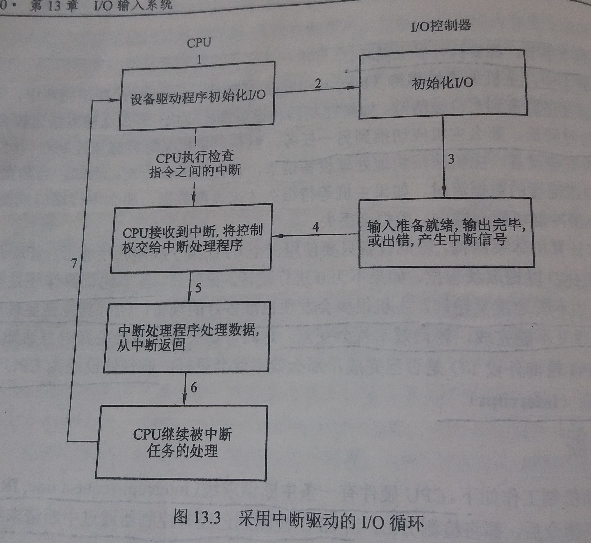

### 13.3 IO应用接口
---
- 通过IO应用接口，使IO设备可以按统一的标准来对待

- 从详细而不同的IO设备中抽象出 **一些** 通用类型

- 每个通用类型都可以通过一组标准函数来访问

- 具体的差别被不同的设备驱动程序所封装

- 这些设备驱动程序一方面可以定制以适合各种设备，另一方面也提供了一组标准接口

- 设备驱动层的作用是为内核IO子系统隐藏设备控制器之间的差异

- 然而每种操作系统都有其自己的设备驱动接口标准

- 如图

- 设备在许多方面都有很大差异
    - 字符流或块
        - 字符流设备按一个字节一个字节地传输
        - 块设备以块为单位传输
    - 顺序访问或随机访问
    - 同步或异步
        - 同步设备按一定响应时间来进行数据传输
        - 异步设备呈现的是无规律或不可预测的响应时间
    - 共享或专用
    - 操作速度
    - 读写、只读、只写

- 绝大多数操作系统存在后门，允许应用程序将任何命令透明地传递到设备控制器，例如UNIX中的`ioctl()`
---
#### 13.3.1 块与字符设备

- 块设备
    - 块设备以块为单位传输
    - 命令接口
        - `read()`：读一个块
        - `write()`：写一个块
        - `seek()`：用于随机访问时，直接跳到任意数据存储位置
    - 原始IO：将块设备当作简单的线性块数组来访问
    - 直接IO：允许应用程序使用禁止缓存和锁的文件模式

- 字符流设备
    - 字符流设备按一个字节一个字节地传输
    - 例如：键盘
    - 命令接口
        - `put()`：写一个字节
        - `get()`：读一个字节
    - 但是还可以构建库以提供具有缓存和编辑功能的按行访问
---
#### 13.3.2 网络设备

- 操作系统为网络设备提供socket接口

- socket接口
    - socket接口的系统调用可以让应用程序创建一个socket，连接本地socket和远程地址
    - socket接口的系统调用可以监听要与本地socket相连的远程应用程序，发送和接受数据
    - socket接口还提供了`select()`函数，以管理一组Socket
---
#### 13.3.3 时钟与定时器

- 许多计算机都有硬件时钟和定时器以提供如下三个基本函数
    - 获得当前时间
    - 获得已经逝去的时间
    - 设置定时器，以在某时间触发某操作

- 可编程间隔定时器(programmable interval timer)
    - 可以测量逝去时间并指定触发操作
    - 它可以被设置为等待一定的时间，然后触发中断
---
#### 13.3.4 阻塞与非阻塞IO
- 阻塞IO
    - 应用程序发起IO请求后，无法继续执行，只有等IO结束，才可继续执行
- 非阻塞IO
    - 非阻塞系统调用与异步系统调用
        - 非阻塞系统调用
            - 发起IO请求后，数据陆续返回
            - 例如：键盘或鼠标
        - 异步系统调用
            - 不必等待IO完成就可立即返回，应用程序继续执行其代码
            - 在将来IO完成时可以通知应用程序
        - 非阻塞与异步系统调用的区别
            - 非阻塞`read()`会调用并立刻返回可用数据，其读的数据可以等于或小于所要求的，或为0
            - 异步`read()`所要求的传输应完整的执行，但其具体执行可以时将来某个特定时间
---
Copyleft ! 2018 T0UGH. All rights reserved under the MIT license.
