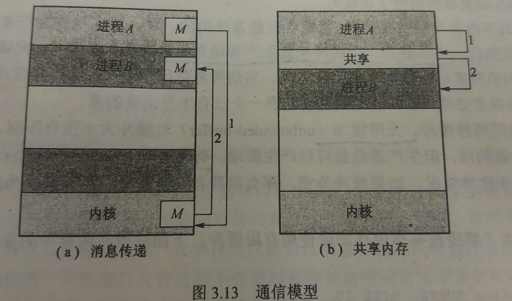

### 3.4 进程间通信（IPC）
--- 

- 进程独立：如果一个进程不能影响其他进程或被其他进程影响

- 进程协作：如果系统中一个进程能影响其他进程或被其他进程影响

- 为什么需要进程协作
    - 信息共享
    - 提高运算速度
    - 模块化
    - 方便

- 协作进程需要一种进程间**通信机制（interprocess communication,IPC)**来允许进程相互交换数据和信息

- 进程间通信的两种基本模式
    1. 共享内存
        - 建立起一块供协作进程共享的内存区域，进程通过向此区域读或写数据来交换信息
        - 共享内存更快，一旦建立了共享内存，所有的访问都被处理为常规的内存访问，不需要来自内核的帮忙
    2. 消息传递
        - 通过在协作进程间交换信息来实现通信
        - 对于交换较少数量的数据很有用
- 通信模型

---
#### 3.4.1 内存共享系统

- 采用共享内存的进程间通信需要通信进程建立**共享内存区域**

- 通常操作系统试图阻止一个进程访问另一个进程的内存，共享内存需要两个或更多的进程取消这个限制

- 生产者-消费者问题
    - 生产者进程产生信息以供消费者进程消费
    - 为了允许生产者进程和消费者进程能并发执行，必须要有一个**缓冲**来被生产者填充并被消费者所使用
    - 可以使用两种缓冲。无限缓冲对缓冲大小没有限制。有限缓冲假设缓冲大小固定
---
#### 3.4.2 消息传递系统

- 消息传递系统是由操作系统提供机制，让协作进程能通过消息传递工具来进行通信

- 消息传递工具提供至少两种操作：发送（消息）和接收（消息）

- 通信线路
    - 如果进程之间需要通信，它们必须彼此相互发送消息和接收消息，它们之间必须要有通信线路
    - 实现通信线路和`send()`/`receive()`操作的方法
        - 直接或间接通信
        - 同步或异步通信
        - 自动或显式通信
1. 命名
    - 直接通信
        - 进程之间直接互发消息
        - 需要通信的每个进程必须明确地命名通信的接收者或发送者
        - 属性
            - 在需要通信的每对进程之间自动建立线路，进程仅需知道相互通信的标识符
            - 一个线路只与两个进程相关
            - 每对进程之间只有一个线路
        - 对称寻址和非对称寻址
        - 缺点：限制了进程定义的模块化
    - 间接通信
        - 通过**邮箱**或端口来发送和接收消息
        - 邮箱：可以抽象为一个对象，进程可以向其中存放消息，也可从中删除消息，每个邮箱都有一个唯一的标识符
        - 属性
            - 只有在两个进程共享一个邮箱时，才能建立通信线路
            - 一个线路可以与两个或更多的进程相关联
            - 两个通信进程之间可有多个不同的线路，每个线路对应一个邮箱
        - 进程或操作系统可以拥有邮箱
        - 如果邮箱为进程所有，即邮箱是进程地址空间的一部分，那么需要区分拥有者（只能通过邮箱接收消息）和使用者（只能通过邮箱发送消息）
2. 同步
    - 消息传递可以是阻塞（同步）或非阻塞（异步）的
    - 阻塞与非阻塞的 `send()` 与 `receive()`
        - 阻塞 `send()`：**发送进程**阻塞，直到消息被接收进程或邮箱接收
        - 非阻塞 `send()`：**发送进程**发送消息并再继续操作
        - 阻塞 `receive()`：接收者阻塞，直到有消息可用
        - 非阻塞 `receive()`：接收者收到一个有效消息或空消息
    - `send()` 和 `receive()`可以进行多种组合

3. 缓冲
    - 通信进程所交换的消息需要驻留在临时队列中
    - 队列实现有三种方法：
        - 零容量：队列的最大长度为0。线路中不能有任何消息处于等待。必须阻塞发送者
        - 有限容量：队列的最大长度为n，最多有n条消息驻留其中。队列未满，发送者不需阻塞。队列满，发送者需要阻塞
        - 无限容量：队列长度无限，**从不**阻塞发送者

---
&copy; 2018 T0UGH. All rights reserved.