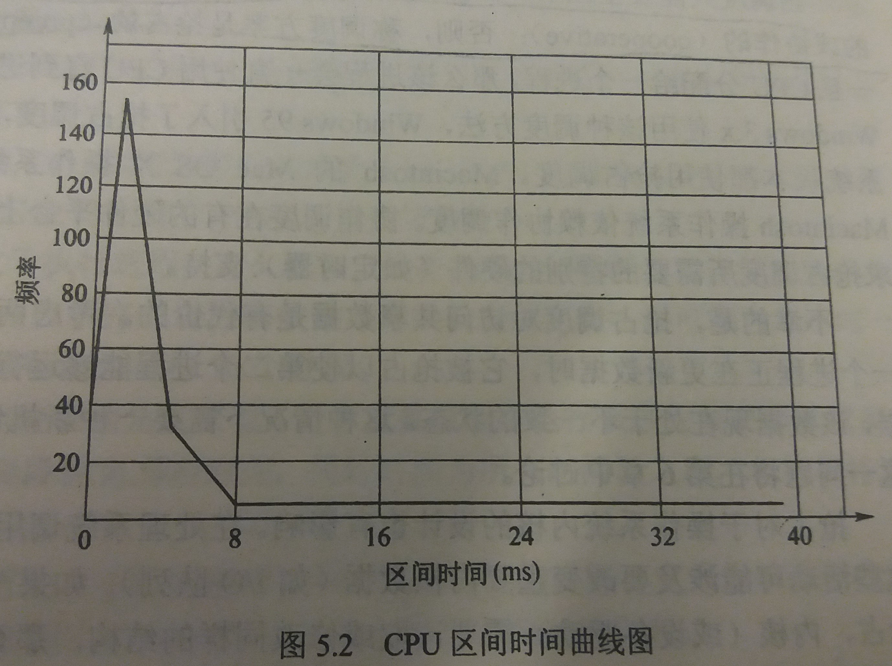

### 5.1 基本概念
---
- 对于**单处理器**系统，每次只允许**一个**进程运行

- 多道程序的**目标**：在任何时候都有某些进程在运行，以使CPU使用率最大化

- 多道程序的**思想**：
    - 多个进程可同时处于内存中
    - 进程执行直到它必须等待
    - 当一个进程必须等待时，操作系统从该进程拿走CPU的使用权，将CPU交给其他进程

- 几乎所有的计算机资源在使用前都要**调度**
---
#### 5.1.1  CPU-I/O 区间周期
---
- 进程执行由CPU执行和I/O等待**周期**组成

- 进程在这两个状态之间切换

- CPU 区间 ( CPU burst ) 和 I/O 区间 ( I/O burst )

- CPU区间的长度分布：具有大量短CPU区间和少量长CPU区间，如图

---
#### 5.1.2 CPU调度程序
---
- 每当CPU空闲时，操作系统就必须从**就绪队列**中选择一个进程来执行

- 进程选择由**短期调度程序**或CPU调度程序执行

- **就绪队列**可实现为：FIFO队列、优先队列、树、无序链表

- 队列中的记录通常为进程控制块（ PCB ）
---
#### 5.1.3 抢占调度
---
- 采用非抢占调度，一旦CPU分配给一个进程，那么该进程会一直使用CPU直到进程终止或切换到等待状态

- 如果调度方案是非抢占式的，则CPU调度决策只能发生在
    - 当一个进程从运行状态切换到等待状态
    - 当一个进程从运行状态切换到就绪状态

- 如果调度方案是抢占式的，则CPU调度可以发生在
    - 当一个进程从运行状态切换到等待状态
    - 当一个进程从运行状态切换到就绪状态
    - 当一个进程从等待状态切换到就绪状态
    - 当一个进程终止时

- 抢占调度的代价
    - 两个进程访问共享数据的代价
    - 内核与进程之间共享数据的代价
---
#### 5.1.4 分派程序
- 分派程序：分派程序是一个模块，用来将CPU的控制交给由**短期调度程序选择**的进程

- 分派程序的功能
    - 切换上下文
    - 切换到用户模式
    - 跳转到用户程序的合适位置，以重新启动程序

- 分派延迟（dispatch latency）：分派程序停止一个进程而启动另一个进程所要花的时间
--- 
&copy; 2018 T0UGH. All rights reserved.