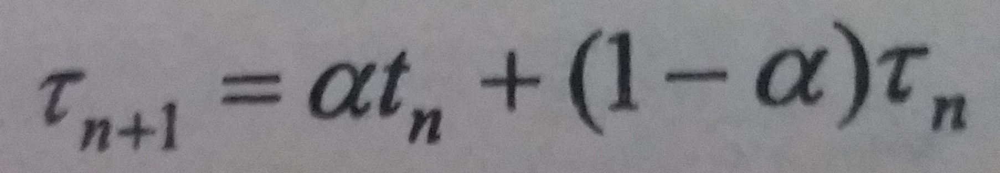

### 5.3 调度算法
---
#### 5.3.1 先到先服务调度（first-come,first-served,FCFS）
---
- 简述：先请求CPU的进程先分配到CPU

- 实现数据结构：FIFO队列

- 缺点：平均等待时间比较长

- 护航效果(convoy effect)：所有其他进程都等待一个大进程释放CPU，这称为**护航效果**
---
#### 5.3.2 最短作业优先算法（shortest-job-first，SJF）
---
- 简述：当CPU为空闲时，它会赋给具有最短CPU区间的进程

- 如果两个进程具有同样长度，那么可以使用FCFS调度来处理

- 优点：平均等待时间最短

- 困难：
    - 问题：难以知道CPU区间的长度（时间），因此难以在短期CPU调度层次上加以实现
    - 解决：某个进程的下一个CPU区间长度可以预测为此进程以前CPU区间的测量长度的指数平均，如图
    

- 抢占式SJF调度有时称为最短剩余时间优先调度

---
#### 5.3.3 优先级调度（priority scheduling）
---
- 简述：每个进程都有一个优先级与其关联，具有最高优先级的进程会分配到CPU。具有相同优先级的进程按照FCFS顺序调度

- 优先级可通过内部或外部方式来定义
    - 内部定义优先级使用一些测量数据来计算进程优先级
    - 外部优先级是通过操作系统之外的准则来定义的

- 优先级调度算法的主要问题是无穷阻塞（indefinite blocking）或饥饿（starvation）
    - 可以运行但缺乏CPU的进程可以认为是阻塞的
    - 优先级调度算法会使某个低优先级进程无穷等待CPU

- 低优先级进程无穷等待问题的解决之一是**老化**（aging）：可以逐渐增加在系统中等待很长时间的进程的优先级
---
#### 5.3.4 轮转法调度（round-robin，RR）
---
- 简述：
    - 轮转法为分时系统设计
    - 时间片（timeslice）：一个较小时间单元
    - 将就绪队列作为循环队列，CPU调度程序循环就绪队列，为每个进程分配不超过一个时间片的CPU

- 进程执行中的两种情况
    - 进程只需要小于时间片的CPU区间，此时，进程本身会自动释放CPU
    - 当前运行进程的CPU区间比时间片要长，定时器会中断并产生操作系统中断，然后进行上下文切换，将进程加入到就绪队列的尾部
---
#### 5.3.5 多级队列调度
---
- 简述：
    - 多级队列调度算法将就绪队列分为多个独立队列
    - 根据进程的属性，一个进程被永久分配到一个队列
    - 每个队列有自己的调度算法
    - 队列之间也有调度，通常采用固定优先级抢占调度
- 每个队列与更底层队列相比有绝对的优先级，只有优先级高的队列为空时，优先级低的队列才有可能执行
---
#### 5.3.6 多级反馈队列调度
---
- 简述：
    - 多级反馈队列调度算法允许进程在队列之间移动
    - 如果进程使用过多CPU时间，它会被移动到更低优先级的队列
    - 在较低优先级队列中等待时间过长的进程会被转移到更高优先级队列

- 多级反馈队列调度是最通用的CPU调度算法
- 它也是最复杂的算法
---
&copy; 2018 T0UGH. All rights reserved.