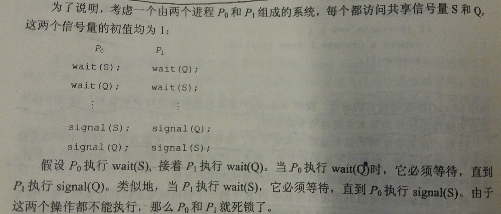

 ### 6.5 信号量( semaphore )
---
- 信号量
    - 整数变量
    - 具有两个标准的**原子**操作
        - `wait()` 或 `P()`
        - `signal()` 或 `V()`
    - `wait()` 的伪代码
        ````
        wait(s){
            while(s<=0){
                //no-op
            }
            s--;
        }
        ````
    - `signal()` 的伪代码
        ````
        signal(s){
            s++;
        }
        ````
---
#### 6.5.1 用法
---
- 计数信号量
    - 值域不受限制
    - 可以用来控制访问若干个实例的某种资源
    - 可以理解为 `wait()` 用来请求并获得一个资源，而 `signal()` 用来释放一个资源

- 二进制信号量
    - 值只能是 `0` 或 `1`
    - 可以提供互斥，来处理多进程临界区问题
---
#### 6.5.2 实现
---
- **忙等待问题**：

    - 当一个进程位于其临界区内时，任何**其他**试图进入其临界区的进程都必须在进入区代码中连续地**循环**
    - 浪费了CPU时钟
    - 又称为**自旋锁**，因为进程在其等待锁时还在运行
    - 常用于**多处理器系统**中，一个线程在自旋，另一个线程在另一个处理器上在临界区内执行

- 如何克服忙等待?
    
    - 思路：
        - 当一个进程执行 `wait()` 时，发现信号量值不为正
        - 则此时这个进程不是忙等，而是阻塞自己
        - 阻塞操作将这个进程放入到与信号量相关的等待队列中
        - 并且将这个进程的状态切换至等待状态
        - 最后，一个被阻塞在等待信号量S上的进程，可以在其他进程执行`signal()`操作之后被重新执行。该进程重新执行通过`wakeup()`操作
    
    - 用于解决忙等的重新实现：
        - 信号量定义
            ````C
            typedef struct{
                int value;
                struct process *list;
            }semaphore;
            ````
            每个信号量都有一个`int`值和一个进程链表
        
        - `wait()` 的定义
            ````C
            void wait(semaphore *s){
                s->value--;
                if(s->value<0){
                    add this process to S->list;
                    block();
                }
            }
            ````
        
        - `signal`的定义
            ````C
            void signal(semaphore *s){
                s->value++;
                if(s->value<=0){
                    remove a process P from S->list;
                    wakeup(P);
                }
            }
            ````
        
        - 操作`block()`用于挂起调用它的进程，操作`wakeup(P)`重新启动阻塞进程P的执行，这两个操作由操作系统直接提供

        - 信号量如果 `value` 为负，则说明有 `abs(value)` 个进程处于等待状态

        - 等待进程的链表可以使用任何排队策略

        - 原子性的控制
            - 单处理器环境下，可以在执行 `wait()` 和 `signal()` 操作时简单地**禁止中断**
            - 多处理器环境下，需要其他方法
---
#### 6.5.3 死锁与饥饿
---
- 死锁( deadlock )

    - 定义：两个或多个进程无限地等待一个事件，而该事件只能由这些等待进程之一来产生

    - 举例：
    

- 饥饿( starvation )
    - 定义：进程在信号量内无限期等待，又叫无限期阻塞( indefinite blocking )
---
&copy; 2018 T0UGH. All rights reserved.