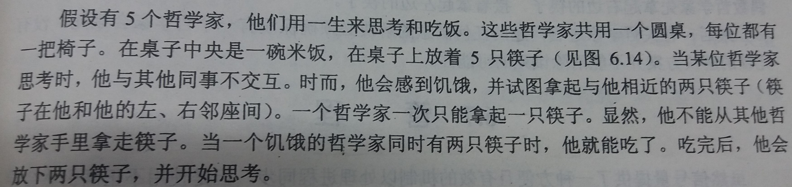

### 6.6 经典同步问题
---
#### 6.6.1 有限缓冲问题

- 生产者-消费者问题：[详见此处](../ch3-进程\4-进程间通信(IPC).md)

- 有限缓冲
    - 当缓冲区为空时，不允许消费者消费
    - 当缓冲区为满时，不允许生产者生产
    - 不允许多个进程同时对缓冲区进行操作

- 信号量说明

    - mutex：提供对缓冲池访问的**互斥要求**，初始化为 `1`
    - empty：表示**空缓冲项的个数**，初始化为 `n`
    - full：表示**满缓冲项的个数**，初始化为 `0`

- 理解
    - 生产者消费空间，生产产品
    - 消费者消费产品，生产空间

- 生产者进程伪代码
    ````C
    do{
        生产一个产品();
        
        wait(empty);
        wait(mutex);

        临界区代码：将产品加入缓冲( buffer );
        
        signal(mutex);
        signal(full);
    }while(true);
    ````

- 消费者进程伪代码
    ````C
    do{
        wait(full);
        wait(mutex);
        
        临界区代码：将一个产品拿出缓存( buffer );
        
        signal(mutex);
        signal(empty);
        
        消费一个产品();
    }while(true);
    ````
---
#### 6.6.2 读者-写者问题

- 读者
    - 只需要读取数据的进程
    - 允许多个读者同时访问数据

- 写者
    - 可能要更新数据（读与写）的进程
    - 写者对共享数据有排他的访问

- 三种读写者问题的变种
    - 读者优先（第一读者-写者问题）
        - 只有当所有读者对文件的访问全部结束，写者才能访问文件
        - 写者可能饥饿
    - 写者优先（第二读者-写者问题）
        - 当读者队列访问文件时，如果有写者想要访问文件，会阻塞读者队列，让写者访问文件
        - 读者可能饥饿
    - 公平竞争
        - 读者写者对文件的访问优先级是相同的
        - 避免饥饿问题

- 读者优先的详细解读

    - 共享数据结构
        ````C
        semphore mutex,wrt;
        int readCount;
        ````
    - 共享数据结构解读
        - readCount：用于跟踪有多少进程在读数据，初始化为 `0`
        - mutex：确保在更新变量readCount时的互斥，初始化为 `1`
        - wrt
            - 为读者和写者进程共用
            - 供写者作为互斥信号量
            - 只有读者队列中的第一个和最后一个使用它
            - 初始化为 `1`;

    - 写者进程伪代码
        ````C
        do{
            wait(wrt);

            写数据();

            signal(wrt);
        }while(true);
        ````
    
    - 读者进程伪代码
        ````C
        do{
            wait(mutex);
            readCount++;
            if(readCount==1){
                wait(wrt);
            }
            signal(mutex);

            读数据();

            wait(mutex);
            readCount--;
            if(readCount==0){
                signal(wrt);
            }
            signal(mutex);
        }while(true);
        ````
---
#### 6.6.3 哲学家进餐问题
- 问题描述

    并且必须确保没有哲学家饿死

- 解决方案
    - 共享数据：`semaphore chopstick[5]`
    - 每只筷子都用一个信号量来表示
    - `wait()` 来获得相应的筷子
    - `signal()` 来释放相应的筷子
    - 所有`chopstick`初始化为 `1`
- 哲学家 `i` 的一种简单伪代码实现
    ````C
    do{
        wait(chopstick[i]);
        wait(chopstick[(i+1)%5]);
        
        eat();

        signal(chopstick[i]);
        signal(chopstick[(i+1)%5]);

        think();
    }while(true);
    ````

- 上述解决会导致死锁：假若5个哲学家同时饥饿并且同时拿起左边的筷子

- 避免哲学家问题死锁的方法
    - 干掉一个哲学家或加一根筷子
    - 只有两根筷子都可用时，才允许一个哲学家拿起它们
    - 使用非对称解决方案：奇数哲学家先拿左边的筷子，偶数哲学家先拿右边的筷子
---
&copy; 2018 T0UGH. All rights reserved.