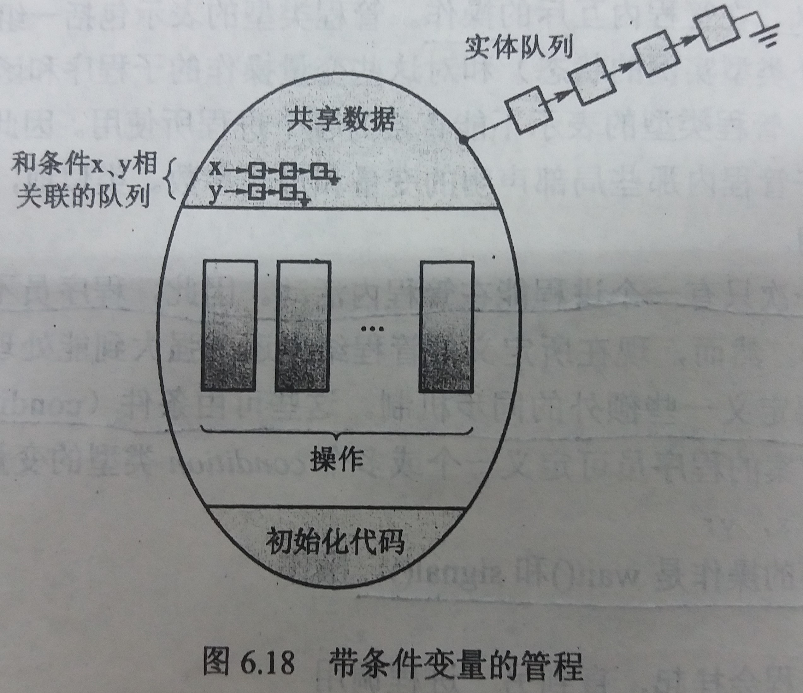
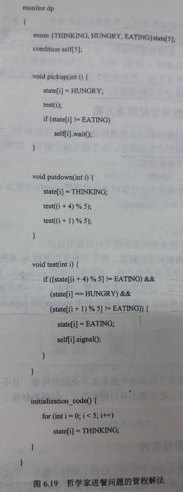

### 6.7 管程
---
- 背景：信号量如果不正确地用来解决临界区问题，很容易产生各种类型的错误
---
#### 6.7.1 使用

- 管程结构确保一次只有一个进程能在管程内活动

- 然而还需要提供能处理一些特定同步方案的功能

- 条件( condition )结构：
    - 用来提供能处理一些特定同步方案的功能
    - 对条件( condition ) `x` 的仅有的操作是 `x.wait()` 与 `x.signal()`
    - `x.wait()` ：调用操作的进程会挂起，直到另一进程调用 `x.signal()`
    - `x.signal()`：重新启动一个挂起的进程，如果没有进程挂起，则操作`x.signal()`没有作用

- 带条件变量的管程示意图


- 到底执行谁问题
    - 问题情景：假设当操作 `x.signal()` 为一个进程P所调用，有一个悬挂进程Q与条件变量 `x` 相关,此时Q被 `wakeup()` ,那么问题来了：因为只能有一个进程在管程中活动，管程是应该执行P还是执行Q呢？
    - 两种解决
        - 唤醒并等待
            - 描述：进程P等待直到Q离开管程或被另一个条件挂起
            - 缺点：需要让正在执行的P停下来
        - 唤醒并继续
            - 描述：进程Q等待直到P离开管程或被另一个条件挂起
            - 缺点：Q所等待的逻辑条件在Q重新启动时可能已不再成立
    - Pascal的解决方案：当进程P执行 `x.signal()` 时，P会立刻离开管程，Q立即执行
--- 
#### 6.7.2 基于信号量的管程实现

- 信号量 `mutex`
    - 用来确保一次只有一个进程能在管程内活动
    - 进程在进入管程之前必须执行 `wait(mutex)`
    - 在离开管程之后必须执行 `signal(mutex)`

- 假如一个函数 `F()` 要进入管程执行，它会如下所示：
    ````C
    wait(mutex);

    F();

    if(next_count>0){
        signal(next);//现在先不用管，与条件变量有关系
    }else{
        signal(mutex);
    }
    ````
    这样确保了管程内互斥

- 对于每个条件变量 `x`，引入信号量 `x_sem` 和整数变量 `x_count` ，且均初始化为`0`

- 信号量 `x_sem`：用于将调用 `x.wait()` 的进程挂起

- 计数器 `x_count`：用于表示目前等待在 `x_sem` 上的进程数目，若数目等于 `0`，则 `x.signal()` 就不用唤醒任何进程，若数目 `>0` 才会唤醒一个进程

- 信号量 `next`：用于供调用了 `x.signal()` 的进程挂起自己，已实现执行被 `x.signal()` 唤醒的进程

- 计数器`next_count`：用于表示目前等待在`next`上的进程数目

- `x.wait()` 的伪代码
    ````C
    x_count++;//因为此进程需要等待条件x,所以x_count要++

    if(next_count>0){ //|begin
        signal(next); //|
    }else{            //|用于唤醒一个进程
        signal(mutex);//|end
    }

    wait(x_sem);//阻塞在此处
    x_count--;//等待完毕,将x_count--;
    ````

- `x.signal()` 的伪代码
    ````C
    if(x_count>0){
        next_count++;
        signal(x_sem);
        wait(next);
        next_count--;
    }
    ````
    如果目前有进程阻塞在`x_sem`上，就唤醒它并且将自己阻塞在`next`上
---
#### 6.7.3 管程内的进程重启
- 问题：如果有多个进程悬挂在条件 `x` 上，且某个进程执行了操作 `x.signal()`，如何决定应重新运行哪个挂起进程？

- 解决
    - 先到先服务(FCFS)
    - 基于优先度进行实现
---
####  6.7.4 哲学家进餐问题的管程解决方案

- 避免死锁：要求一个哲学家在两只筷子均可用时才拿起筷子

- 哲学家 `i` 的伪代码
    ````java
    dp.pickup(i);
    eat();
    dp.putdown(i);
    ````
- 管程实现

---
&copy; 2018 T0UGH. All rights reserved.