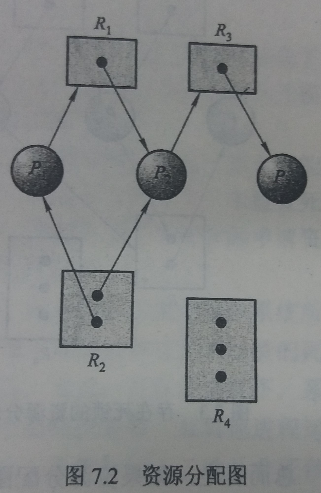

### 7.2 死锁特征

---

#### 7.2.1 必要条件

- 如果一个系统中下面4个条件**同时满足**，则会引起死锁

    1. 互斥：至少有一个资源必须处于非共享模式，即一次只有一个进程使用
    2. 占有并等待：一个进程必须占有至少一个资源，并等待另一资源，而该资源为其他进程所占用
    3. 非抢占：资源不能被抢占，即资源只能在进程完成任务后自动释放
    4. 循环等待：有一组等待进程`{P0,P1,...,Pn}`，`P0` 等待的资源为`P1` 所占用，`P1` 等待的资源为 `P2` 所占用

- 循环等待意味着占有并等待，这4个条件并**不完全独立**
---

#### 7.2.2 资源分配图

- 资源分配图可以用来更精确地描述死锁问题

- 举例

- 图例说明
    - 圆形节点：进程
    - 矩形节点：资源类型
    - 矩形中的圆点：资源实例
    - 从**进程**指向**资源类型**的有向边
        - 名称：申请边
        - 意义：进程 `Pi` 已经申请了资源类型 `Rj` 的一个实例，正在等待该资源
        - 注意：箭头并不指向资源实例，只指向资源类型
    - 从**资源实例**指向**进程**的有向边
        - 名称：分配边
        - 意义：表示资源 `Rj` 的一个实例已经分配给进程 `Pi`
        - 注意：边的起点是资源实例，而不是资源类型

- 使用方法
    - 如果分配图没有环，那么系统就没有进程死锁
    - 如果分配图有环，那么可能存在死锁
        - 如果每个资源刚好只有一个实例，则有环必然死锁
        - 如果每个资源有多个实例，则有环并不意味着已经出现了死锁
---
&copy; 2018 T0UGH. All rights reserved.