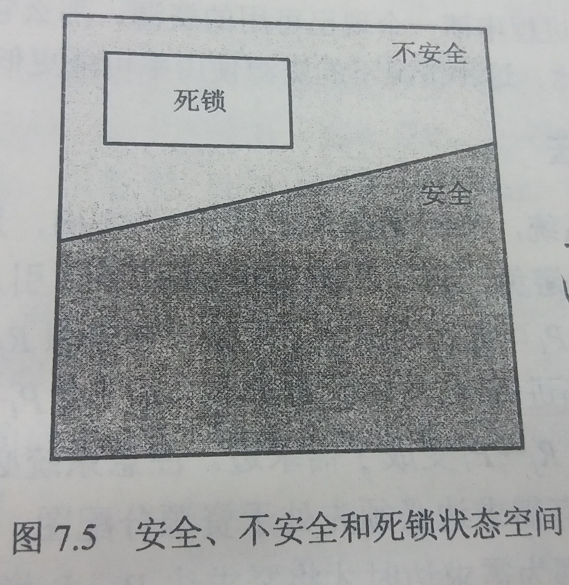
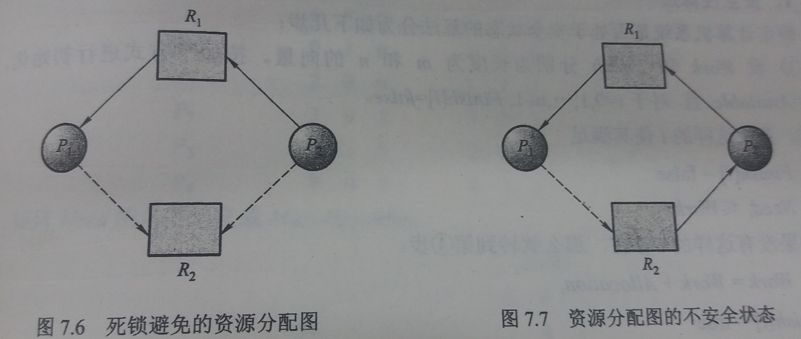

### 7.5 死锁避免
---
- 死锁避免：死锁避免算法动态地检测资源分配状态以确保循环等待条件不可能成立
- 资源分配状态：可用资源、已分配资源、进程最大需求
---
#### 7.5.1 安全状态
---
- 安全状态：如果存在一个安全序列，那么系统处于安全状态

- 安全序列：进程顺序 `<P1,P2,...Pn>`,如果对于每个 `Pi`,`Pi` 仍然可以申请的资源数小于当前可用资源加上所有进程 `Pj` (其中`j<i`)所占用的资源，那么这一顺序称为安全序列

- 死锁状态是不安全状态的子集，如图


- 当系统收到进程发送的申请资源的申请，先假设将进程申请的资源分配给进程，然后根据分配出去之后的资源分配状态来计算当前是否具有安全序列，如果具有就是安全状态，可以将申请的资源分配给进程
---
#### 7.5.2 资源分配图算法
---
- 适用范围：每个资源类型只有一个实例

- 算法实现
    - 首先实现 [7.2.2中的资源分配图](2-死锁特征.md)
    - 然后定义需求边
        - 表示进程 `Pi` 可能在将来某个时间申请资源 `Rj`
        - 用虚线表示
    - 定义边之间的转换
        - 当进程 `Pi` 可能在申请资源 `Rj` 时，需求边 `Pi->Rj` 变为申请边
        - 当进程 `Pi` 释放资源 `Rj` 时，分配边变为需求边
    - 假设进程 `Pi` 申请资源 `Rj`，只有在将申请边 `Pi->Rj` 变为分配边 `Rj->Pi` 而不会导致资源分配图形成环时，才允许申请

- 算法时间复杂度
    - `n*n`
    - n是系统的进程数量

- 例如

---
#### 7.5.3 银行家算法

- 适用范围：每个资源类型有多个实例的资源分配系统

- 算法思路
    - 当新进程进入系统时，必须要说明其可能需要的每种类型资源实例的最大数量
    - 当用户申请一组资源时，系统必须确定这些资源的分配是否仍会使系统处于安全状态
    - 如果是，则分配资源
    - 否则，进程必须等待直到某个其他进程释放足够资源为止

- 数据结构（ `n` 为系统进程个数，`m` 为资源类型的种类）
    - `Available`：长度为 `m` 的向量，表示每种资源的现有实例的数量
    - `Max`：`n` * `m` 矩阵，定义每个进程的最大需求
    - `Allocation`：`n` * `m` 矩阵，定义每个进程现在所分配的各种资源类型的实例数量
    - `Need`：`n` * `m` 矩阵，表示每个进程还需要的剩余的资源
- 安全性算法：确定计算机系统是否处于安全状态的算法分为如下几步
    1. 设 `Work` 和 `Finish` 分别为长度为 `m` 和 `n` 的向量
        ````py
        Work=Available
        for i in range(0,n):
            Finish[i]=false
        ````
    2. 查找这样的`i`使其满足
        - `Finish[i]=false`
        - `Need[i]<=work`  
        如果没有这样的`i`，转到第4步 
    3. 
        ````py
        Work=Work+Allocation[i]
        Finish[i]=true
        ````
        返回第二步
    4. 如果对所有 `i` ,`Finish[i]=true` ，那么系统处于安全状态

- 资源请求算法
    - 设 `Requesti` 为进程 `Pi` 的请求向量，`Requesti[j]=k` 的意思是：进程 `Pi` 需要资源类型 `Rj` 的实例数量为 `k`
    - 当进程 `Pi` 做出资源请求时，采取如下动作  
        1. 如果 `Requesti<=Needi` ,转到第2步，否则报错，因为进程 `Pi` 已超过最大请求
        2. 如果 `Requesti<=Available` ,转到第3步，否则 `Pi` 必须等待，这是因为没有可用资源
        3. 假定系统可以分配给进程 `Pi` 所请求的资源，并按如下方式修改状态
            ````py
            Available=Available-Requesti;
            Allocationi=Allocationi+Requesti;
            Needi=Needi-Requesti
            ````
            然后使用安全性算法判断当前状态是否安全，如果安全则分配资源，否则 `Pi` 等待
---
&copy; 2018 T0UGH. All rights reserved.