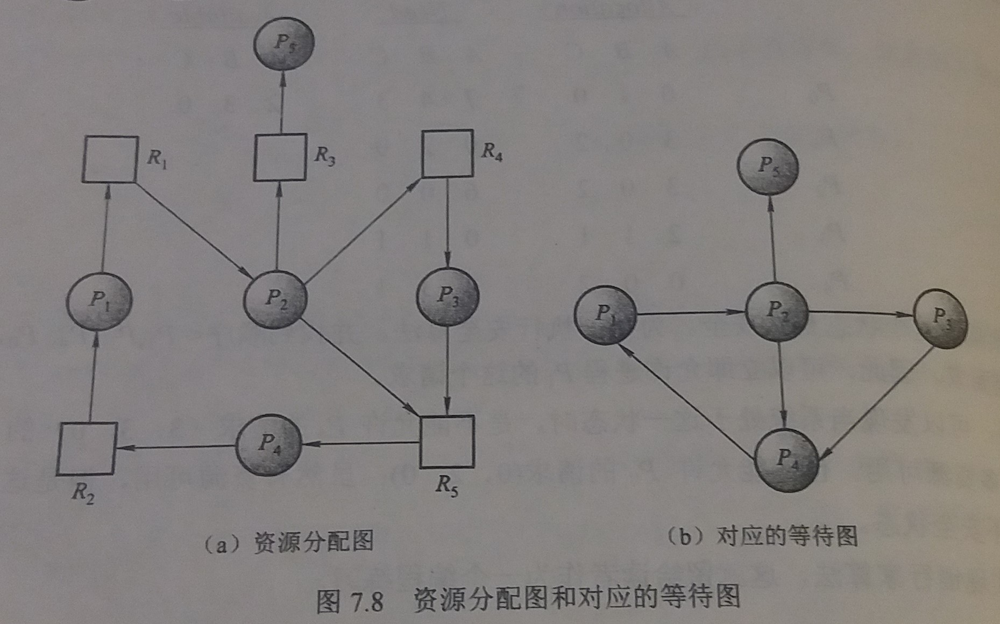

### 7.6 死锁检测
---

- 如果系统即不采用死锁预防算法也不采用死锁避免算法，那么可能会出现死锁

- 在这种情况下，系统应提供
    - 一个用来检查系统状态从而确定是否出现了死锁的算法 
    - 一个用来从死锁状态中恢复的算法

---
#### 7.6.1  每种资源类型只有单个实例

- 如果所有资源类型只有单个实例可以使用 **等待图**

- 等待图
    - 资源分配图的变种
    - 画法
        - 从资源分配图中删除所有资源类型节点
        - 合并适当边
            - 例如：等待图中有 `Pi` 到 `Pj` 的边意味着进程 `Pi` 等待进程 `Pj` 释放一个 `Pi` 所需的资源
    - 死锁判定：当且仅当等待图中有一个环，系统中存在死锁
    - 时间复杂度 ：`n^2` ( `n` 为进程数)

- 例子

---
#### 7.6.2 每种资源类型可有多个实例

- 基于银行家算法的死锁检测

- 适用范围：每个资源类型有多个实例的资源分配系统

- 算法思路：此算法为需要完成的所有进程研究各种可能的分配序列，只要有一种序列不发生死锁，则假定没有死锁

- 数据结构（ `n` 为系统进程个数，`m` 为资源类型的种类）
    - `Available`：长度为 `m` 的向量，表示每种资源的现有实例的数量
    - `Allocation`：`n` * `m` 矩阵，定义每个进程现在所分配的各种资源类型的实例数量
    - `Request`：`n` * `m` 矩阵，当前各进程的实时资源请求情况

- 算法步骤
    1. 设 `Work` 和 `Finish` 分别为长度为 `m` 和 `n` 的向量
        ````py
        Work=Available
        for i in range(0,n):
            Finish[i]=false
        ````
    2. 查找这样的`i`使其满足
        - `Finish[i]=false`
        - `Request[i]<=work`  
        如果没有这样的`i`，转到第4步 
    3. 
        ````py
        Work=Work+Allocation[i]
        Finish[i]=true
        ````
        返回第二步
    4. 如果有一个 `i` ,`Finish[i]==false` 则系统处于死锁状态
- 算法解释
    - 为什么只要确定 `Request[i]<=work` 就收回进程 `Pi` 的资源?
        - 根据 `Request[i]<=work` 可以得出 `Pi` 不参与死锁
        - 可以乐观地假设，`Pi` 会尽可能快的执行完毕并返回其现已分配的所有资源
        - 如果事实并不如假设般乐观，那么稍后会发生死锁。下次再调用此算法就可以检测到死锁
---
#### 7.6.3 检测算法怎么用
- 应该何时调用检测算法取决于两个因素
    - 死锁可能发生的频率
    - 当死锁发生时多少进程被影响

- 只有当某个进程提出请求且得不到满足时，才会出现死锁

- 一旦发生死锁，会有越来越多的进程陷入死锁

- 不太昂贵的方法是以一个不太高的频率调用检测算法，如每小时一次，或当CPU使用率低于40%时
---
&copy; 2018 T0UGH. All rights reserved.