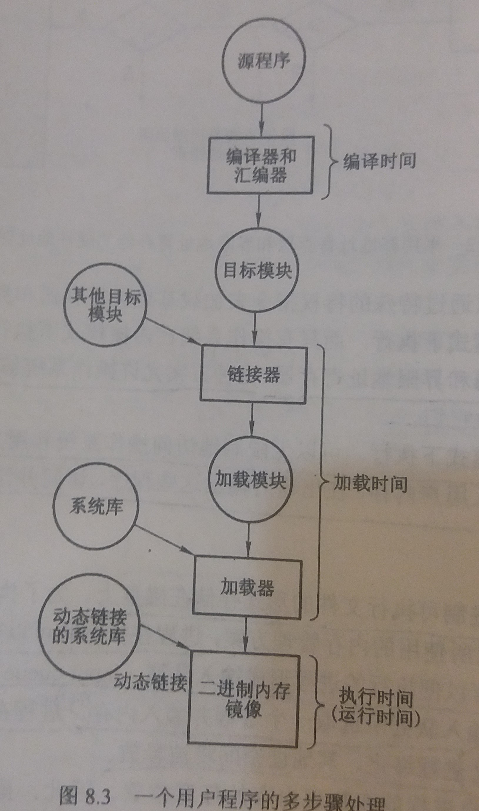

### 8.1 背景
---

- 内存是现代计算机运行的中心

- 内存由很大一组字或字节组成，每个字或字节都有它们自己的地址

- CPU根据程序计数器（PC）的值从内存中提取指令，这些指令可能会引起进一步对特定内存地址的读取和写入
---
#### 8.1.1 基本硬件

- CPU所能直接访问的存储器只有**内存**和处理器内的**寄存器**

- 机器指令可以用内存地址作为参数，而不能用磁盘地址作为参数

- 如果数据不在内存中，那么在CPU使用前必须先把数据移到内存中

---

- CPU内置寄存器通常可以在一个CPU时钟周期内完成访问

- 完成内存访问可能需要多个CPU时钟周期，由于没有数据以便完成正在执行的指令，CPU通常需要暂停（stall）

- 解决方法是在CPU和内存之间增加高速缓存(cache)

---

- 如何确保操作系统不被用户进程所访问，以及确保用户进程不被其他用户进程访问？
    1. 确保每个进程都有独立的内存空间
        - 基地址寄存器
            - 含有最小的合法物理内存地址
        - 界限地址寄存器
            - 决定范围的大小
    2. CPU对用户模式产生的每个地址与上述两个寄存器的地址进行比较
        - 如果发现用户模式下执行的程序试图访问操作系统内存或其他用户内存，则会陷入到操作系统中
        - 这样可以防止用户程序修改操作系统或其他用户的代码或数据结构
    3. 只有操作系统可以修改基地址寄存器和界限寄存器的值

- 操作系统在内核模式下执行，可以无限制的访问操作系统和用户的内存

- 操作系统可以
    - 将用户程序装入用户内存
    - 在出错时输出这些程序
    - 访问并修改系统调用的参数
---
#### 8.1.2 地址绑定

- 程序以二进制可执行文件的形式存储在磁盘上

- 输入队列： 
    - 进程在执行时可以在磁盘和内存之间移动
    - 在磁盘上等待调入内存以便执行的进程形成输入队列

- 进程调入调出的步骤
    1. 从输入队列中选取一个进程并装入内存
    2. 进程在执行时会访问内存中的指令和数据
    3. 进程终止，其内存地址空间将被释放

- 用户进程在执行前需要经过的步骤  

- 将指令与数据绑定到内存地址的几种情况
    - **编译时(compile time)**：如果编译时就知道进程将在内存中的驻留地址，那么就可以生成**绝对代码(absolute code)**

    - **加载时(load time)**：如果编译时并不知道进程将驻留在内存的什么地方，那么编译器必须生成**可重定位代码(relocatable code)**。这种情况下，绑定会延迟到加载时才进行

    - **执行时(execution time)**：如果进程在执行时可以从一个内存段移到另一个内存段，那么绑定必须延迟到执行时才进行。绝大多数操作系统使用这种方法
---
#### 8.1.3 逻辑地址空间与物理地址空间

- **逻辑地址(logical address)**：CPU所生成的地址

- **物理地址(physical address)**：内存单元所看到的地址

- 使用**编译时和加载时的地址绑定方法**，逻辑地址**等于**物理地址

- 使用**执行时的地址绑定方法**，逻辑地址**不等于**物理地址

- 逻辑地址空间(logical address space)：由程序所生成的所有逻辑地址的集合

- 物理地址空间(physical address space)：与这些逻辑地址相对应的所有物理地址的集合

- **内存管理单元(MMU)**：负责在运行时完成从虚拟地址到物理地址的映射

- 一个简单的MMU方案
    - 基地址寄存器在这个称为重定位寄存器(relocation register)
    - 用户进程所生成的地址在送交内存之前，都将加上重定位寄存器的值

- **用户程序绝不会看到真正的物理地址**

- 346还是10346的问题？
    - 问题背景：程序创建了一个指向逻辑地址346的指针，此时基地址寄存器的值为10000

    - 只有当它作为内存地址时，它才进行相对于基地址寄存器的重定位(10346)
        - 例如：间接加载和存储
    - 程序**平时使用时**，不需进行取值什么的操作，使用的只是逻辑地址(346)
        - 例如：使用它或将它与其他地址进行比较

---
#### 8.1.4 动态加载

- 定义：一个子程序只有在调用时才会被加载

- 所有子程序都以可重定位的方式保存在磁盘上

- 调用子程序首先检查另一个子程序是否已加载，如果没有，可重定位的链接程序将用来加载所需要的子程序

- 优点：不用的子程序绝不会被加载

---
#### 8.1.5 动态链接与共享库

- 静态链接库：系统语言库的处理方式与其他目标模块一样，由加载程序合并到二进制程序镜像中

- 动态链接库：将链接延迟到运行时

- 如果有动态链接，二进制镜像中对每个库程序的引用都有一个存根(stub)，存根是一小段代码，用于指出如何定位适当的内存驻留库程序

- 动态链接需要操作系统的帮助：因为内存中进程是彼此保护的，只有操作系统才可以检查所需子程序是否在其他进程内存空间内，或是允许多个进程访问同一内存地址。
---
&copy; 2018 T0UGH. All rights reserved.