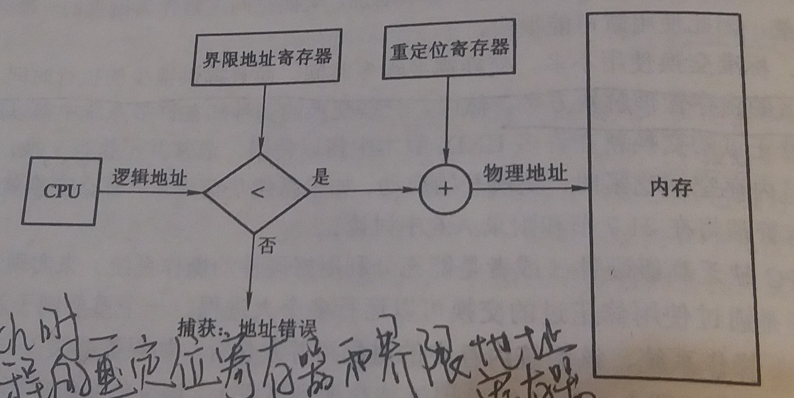

### 8.3 连续内存分配
---
- 内存需要容纳操作系统和各种用户进程

- 内存中，低内存放操作系统，高内存放用户进程

- **连续内存分配**：每个进程位于一个连续的内存区域
---
#### 8.3.1 内存映射与保护

- 通过使用重定位寄存器和界限地址寄存器可以实现这种映射与保护

- 重定位寄存器：存储最小的物理地址值

- 界限地址寄存器：存储逻辑地址的范围值

- 没啥说的，看图吧

- 进行上下文切换时，CPU会将新进程的重定位寄存器和界限地址寄存器装载到CPU寄存器中。由于CPU所产生的每一地址都需要与寄存器进行核对，可以保证操作系统和其他用户程序和数据不受该进程的运行所影响
---
#### 8.3.2 内存分配

-  固定分区方案
    
    - 最为简单的内存分配方法之一是把内存分为**多个固定大小的分区**
    
    - 每个分区只能容纳一个进程
    
    - 当一个分区空闲时，可以从输入队列选择一个进程，以调入到空闲分区
    
    - 当进程终止时，其分区可以被其他进程使用
    
    - 这种方法现在已不再使用了

- 可变分区方案
    
    - 操作系统维护一个表，记录哪些内存可用和哪些内存已被占用
    
    - 孔：一段连续的空闲内存区域
    
    - 当有新进程需要内存时，为该进程查找足够大的孔。如果找到，可以从该
    孔为该进程分配所需的内存，孔未分配的内存可以下次再用
    
    - 如果新孔与其他孔相邻，那么将这些孔合并成大孔
    
    - 从一组可用孔中选择一个空闲孔的方法
        - 首次适应：分配第一个足够大的孔
        - 最佳适应：分配最小的足够大的孔，这种方法可以产生最小剩余孔
        - 最差适应：分配最大的孔，这种方法可以产生最大剩余孔，该孔可能比最佳适应方法产生的较小剩余孔更为有用
---
#### 8.3.3 碎片

- **外部碎片问题**
    - **定义**：当所有总的可用内存之和可以满足请求，但并不连续时，产生外部碎片问题
    - 首次适应方法和最佳适应方法算法都有外部碎片问题
    - **50%规则**：对采用首次适应方法的统计说明，不管使用什么优化，假定有 `N` 个可分配块，那么可能有 `0.5N` 个块为外部碎片，即 `1/3` 的内存可能不能使用
    - **解决外部碎片问题**
        - 紧缩
            - 定义：移动内存内容，以便所有空闲空间合并成一整块
            - 如果地址被动态重定位，可以首先移动程序和数据，然后再根据新基地址的值来改变基地址寄存器
        - 允许物理地址空间为非连续，比如 [分页](4-分页.md) 或分段
        
- **内部碎片问题**
    - 定义：进程被分配的内存块大小 `S` 比此进程所需要的内存块大小 `N` 要大，`S-N` 的内存就被称为内部碎片
---
&copy; 2018 T0UGH. All rights reserved.