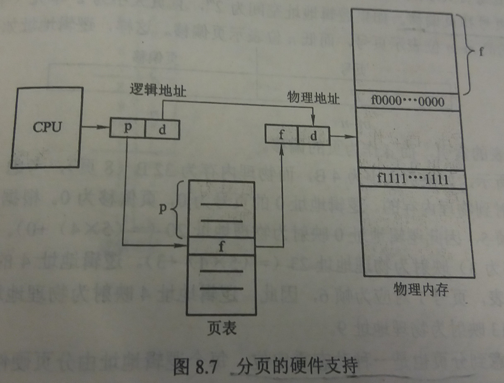
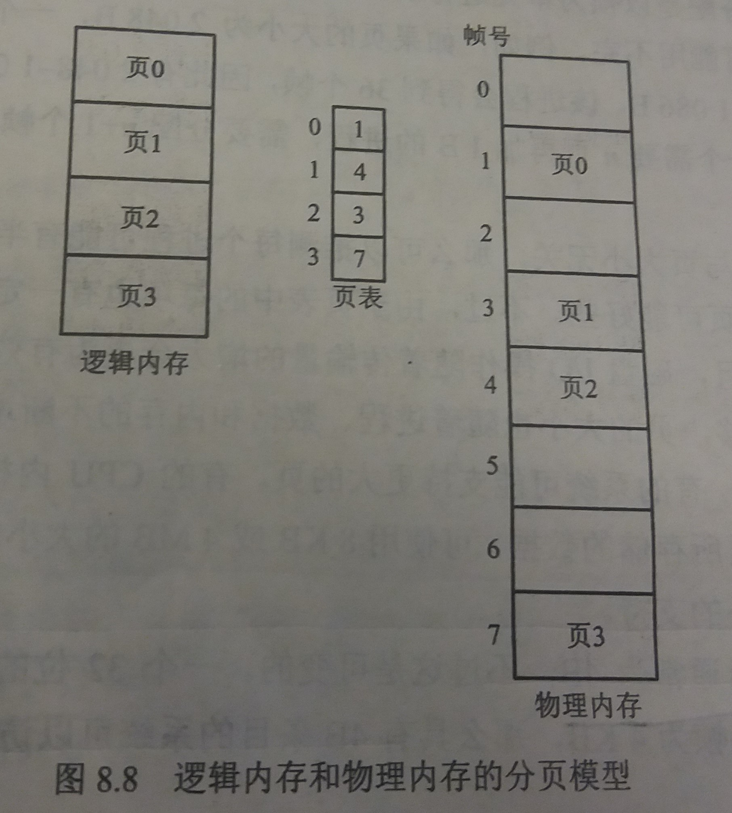
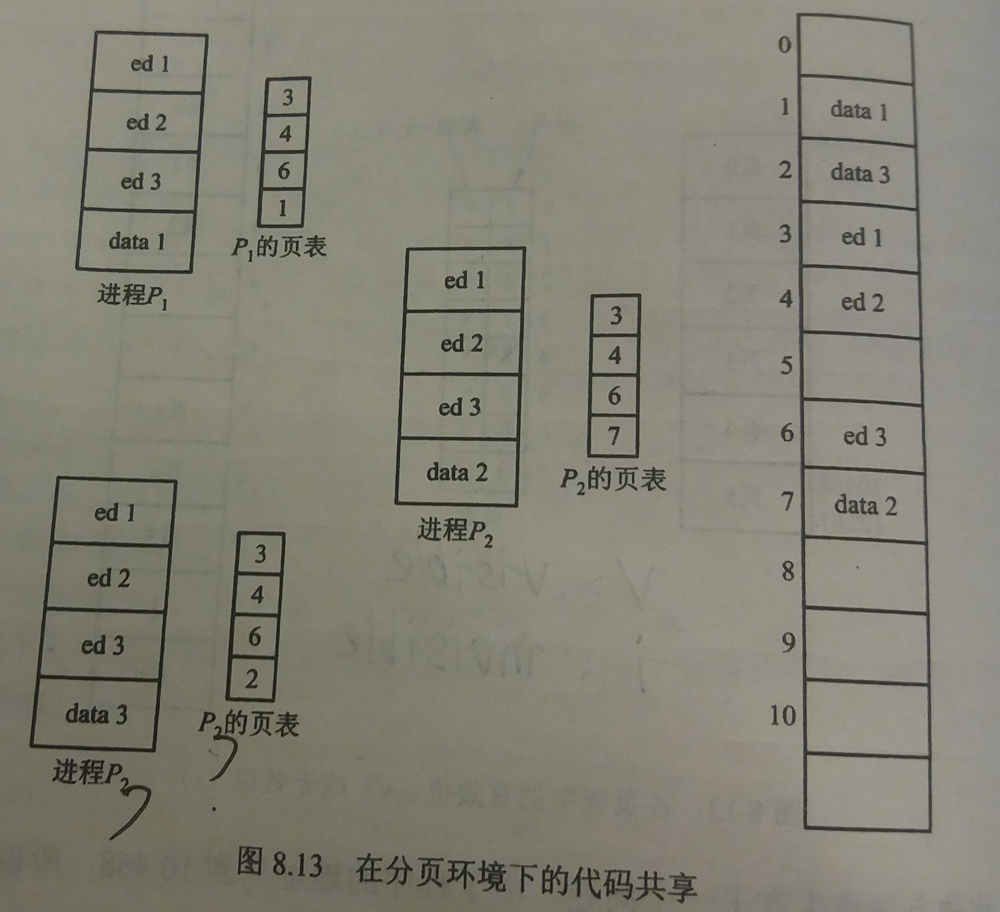

### 8.4 分页( paging )
---
- 分页内存管理方案允许进程的物理地址空间是非连续的

- 分页避免了将不同大小的内存块匹配到交换空间上这样的麻烦
---
#### 8.4.1 基本方法

- 各种定义：
    - **帧**(frame)：将物理内存分为固定大小的块，称为帧
    - **页**(page)：将逻辑内存也分为同样大小的块，称为页
    - **页表**：包含每页的页号和所在物理地址的基地址
    - 页号：页表中的索引
    - 由CPU生成的每个地址分为两个部分：页号(p)和页偏移(d)

- 分页的硬件支持

- 逻辑内存和物理内存的分页模型

- 页大小通常为2的幂数
    - 原因：这样可以方便地将逻辑地址转换为页号和页偏移

- 分页也是一种**动态重定向**
    - 采用分页类似于使用一组基地址寄存器，每个基地址对应着一个内存帧

- 分页不会产生外部碎片，只产生内部碎片

- 页大小通常是4~8KB，每个页表的条目通常为4B

- 分页的一个重要特点是用户视角的内存和实际的物理内存的分离，用户程序将内存作为一整块来处理，而且它只包括这一个进程

- 用户视角的内存和实际的物理内存的差异是通过地址转换硬件协调的。逻辑地址转变为物理地址，这种映射是用户所不知道的，但受操作系统控制

- 页表只包括进程所拥有的那些页

- 操作系统需要维护**帧表**
    - 每个条目对应一个帧
    - 以表示该帧是空闲还是已占用
    - 如果占用，是被哪个进程的哪个页所占用
---
#### 8.4.2 硬件支持

- 进程与页表的关系
    - 操作系统为每个进程分配一个页表
    - 页表与其他寄存器的值一起存入进程控制块中
    - 当调度程序需要启动一个进程时，它必须首先装入用户寄存器，并根据所保存的用户页表来定义正确的硬件页表值

- 基于寄存器的页表硬件实现
    - 将页表作为一组专用寄存器(register)来实现
    - 优点：访问速度很快
    - 缺点
        - 容量过小
        - 增加上下文切换时间

- 基于页表基寄存器(PTBR)的页表硬件实现
    - 将页表放在内存中，并将页表基寄存器(page-table base register,PTBR)指向页表
    - 优点
        - 容量大
        - 上下文切换方便
            - 改变页表只需改变页表基寄存器的指向即可
    - 缺点
        - 将页表放在内存里，访问速度过慢
        - 访问一个数据，需要两次内存访问，效率过低

- 如何解决基于页表基寄存器(PTBR)的页表硬件实现的缺点
    - 采用小但专用且快速的硬件缓冲-----转换表缓冲区(TLB)
        - TLB定义：TLB是关联的快速内存(cache)，只保存页表的小部分内容，查找速度很快
        - 使用方法
            1. 当CPU产生逻辑地址后，其页号提交给TLB
            2. 如果页号在TLB中，可直接找到帧号，然后根据帧号访问内存
            3. 如果页号不在TLB中，访问页表得到帧号，并将帧号和页号存到TLB中
        - 命中率：页号在TLB中被查找到的百分比
        - 有效内存访问时间：自己算去
---
#### 8.4.3 保护

- 在分页环境下，内存保护是通过与每个帧相关联的保护位来实现的

- 通常，这些保护位存在页表中

- 可读写-只读位
    - 每次地址引用，都要通过页表来查找帧号
    - 在计算物理地址的同时，可以通过检查保护位来验证有没有对只读页进行写操作

- 有效-无效位
    - 当该位有效时，表示相关的页在进程的逻辑地址空间中，是有效的页
    - 当该位无效时，表示相关的页不在进程的逻辑地址空间中，是无效的页
---
#### 8.4.4 共享页

- 共享公共代码
    - 代码共享条件：如果代码是可重入代码(reentrant code)，则可以共享
    - 可重入代码：不能自己修改的代码，它从不会在执行期间改变
    - 实现方式：每个用户的页表映射到同一代码副本，而数据则是各自对应各自的
    - 优点：节省内存
    - 例子
    
- 有的操作系统通过共享页来实现共享内存
---
&copy; 2018 T0UGH. All rights reserved.