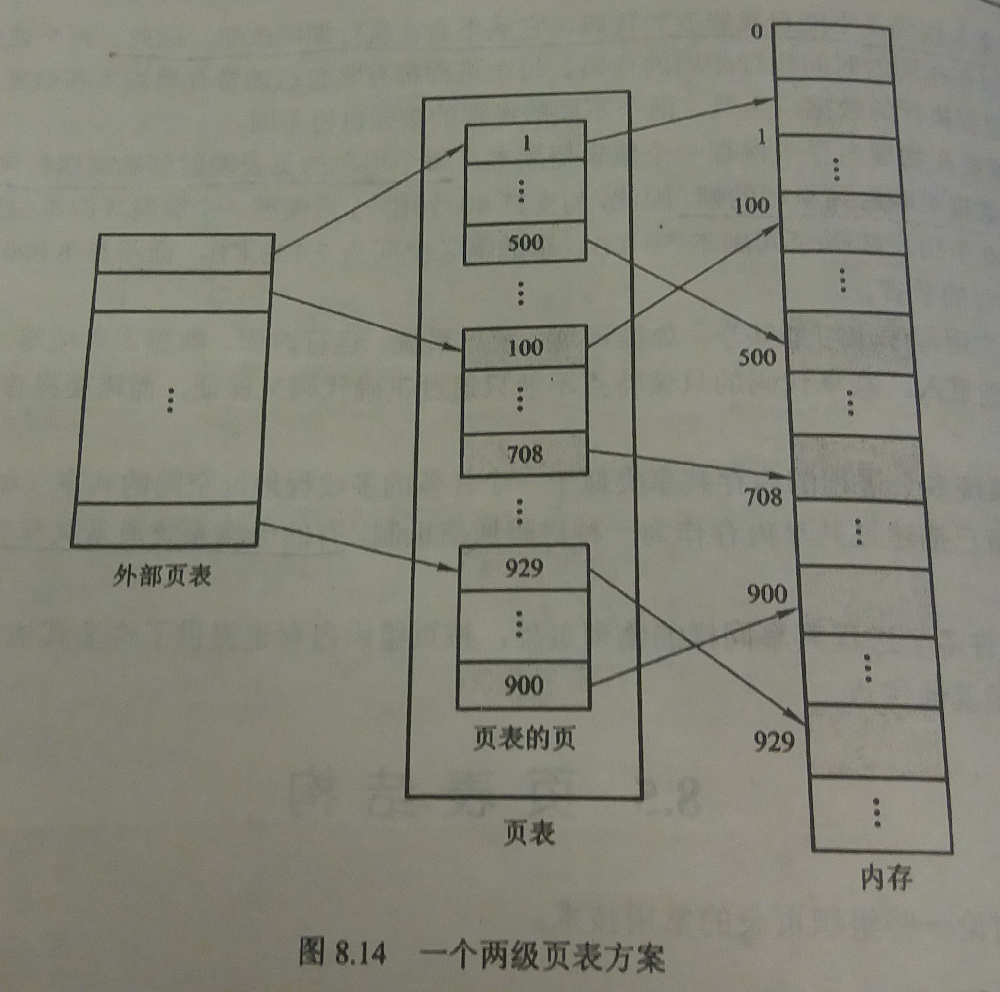
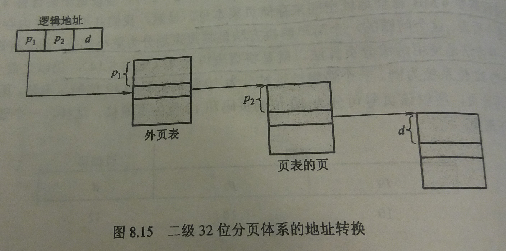

### 8.5 页表结构
---
#### 8.5.1 层次页表
- 背景：计算机系统支持大逻辑地址空间，在这种情况下，每个进程的页表本身就非常大，难以在内存中找到连续空间存储如此大的页表

- 解决方法：对页表再分页

- 例子

- 然而，对于64位体系结构，层次页表并不适合，因为需要分太多层
---
#### 8.5.2 哈希页表
---
- 思路：
    - 以虚拟页码作为哈希值
    - 哈希页表的每个条目包括一个链表的元素，来处理碰撞
    - 链表中的每个元素包括
        - 虚拟页码
        - 所映射的帧号
        - 指向链表中下一个元素的指针
- 具体实现
    1. 通过虚拟地址中的虚拟页号算出哈希表索引
    2. 用虚拟页号与链表中每一个元素的虚拟页码比较
    3. 如果匹配，那么相应的帧号就用来形成物理地址
    4. 如果不匹配，那么就对链表中的下一个节点进行比较，以寻找匹配的页号
#### 8.5.3 反向页表
- 思路：
    - 整个操作系统只维护一张页表
    - 此页表使用物理地址作为索引，每个条目存储页的虚拟地址和所属进程
- 优点：
    - 节省空间：整个系统只用一张页表，每个物理内存的帧只有一条相应的条目
- 缺点
    - 增加了查找页表所需要的时间
    - 在实现共享内存时存在困难
---
&copy; 2018 T0UGH. All rights reserved.