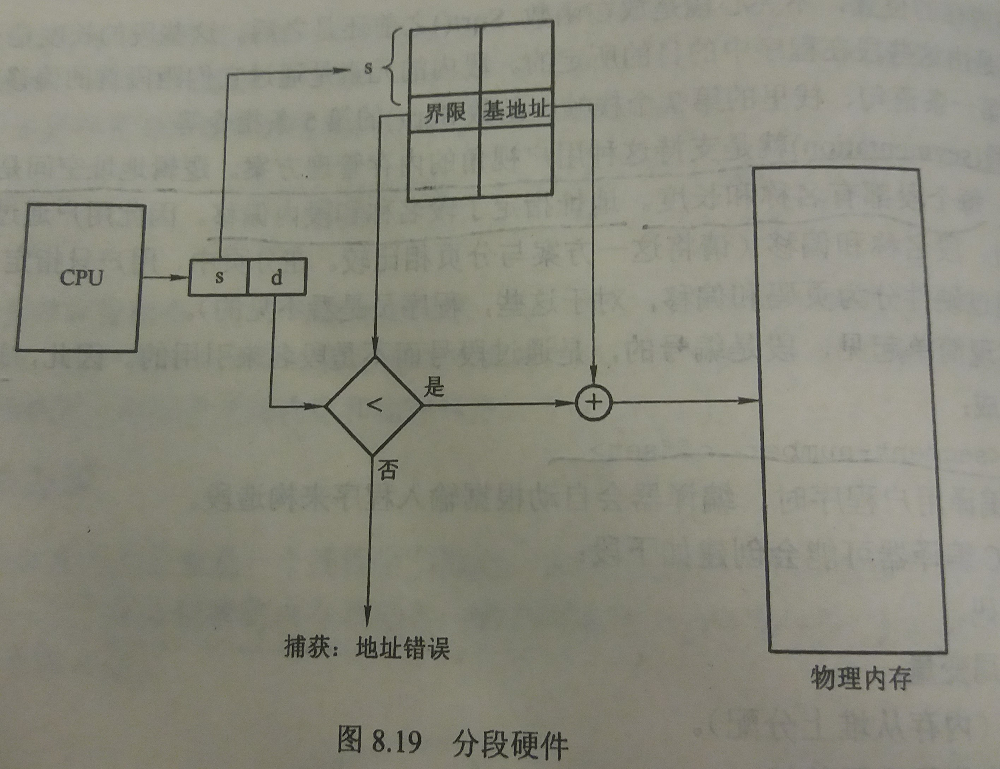

### 8.6 分段(segmentation)
---
#### 8.6.1 基本方法
- 用户视角：用户更愿意将内存看作是一组不同长度的段的集合，这些段之间并没有一定的顺序

- 分段
    - 分段就是支持用户视角的内存管理方案
    - 逻辑地址空间是由一组段组成的
    - 每个段有名称和长度
    - 地址指定了段名称和段内偏移

- 一个C编译器对代码分段的例子
    - 代码
    - 全局变量
    - 堆(内存从堆上分配)
    - 每个线程采用的栈
    - 标准的C-language库函数
---
#### 8.6.2 硬件
- 基于段表的硬件实现
    - 定义
        - 段表：将段号和段内偏移转换为物理地址
        - 段表的每个条目都包括段基地址和段界限
        - 段基地址：该段在内存中的开始物理地址
        - 段界限：该段的长度
    - 实现
        - 逻辑地址由段号s和段内的偏移d组成
        - 段号作为段表的索引，逻辑地址的偏移d在0和段界限之间
        - 如果偏移d合法，那么就与段基地址相加得到物理地址
        - 如果偏移d不合法，报错
- 如图

---
&copy; 2018 T0UGH. All rights reserved.