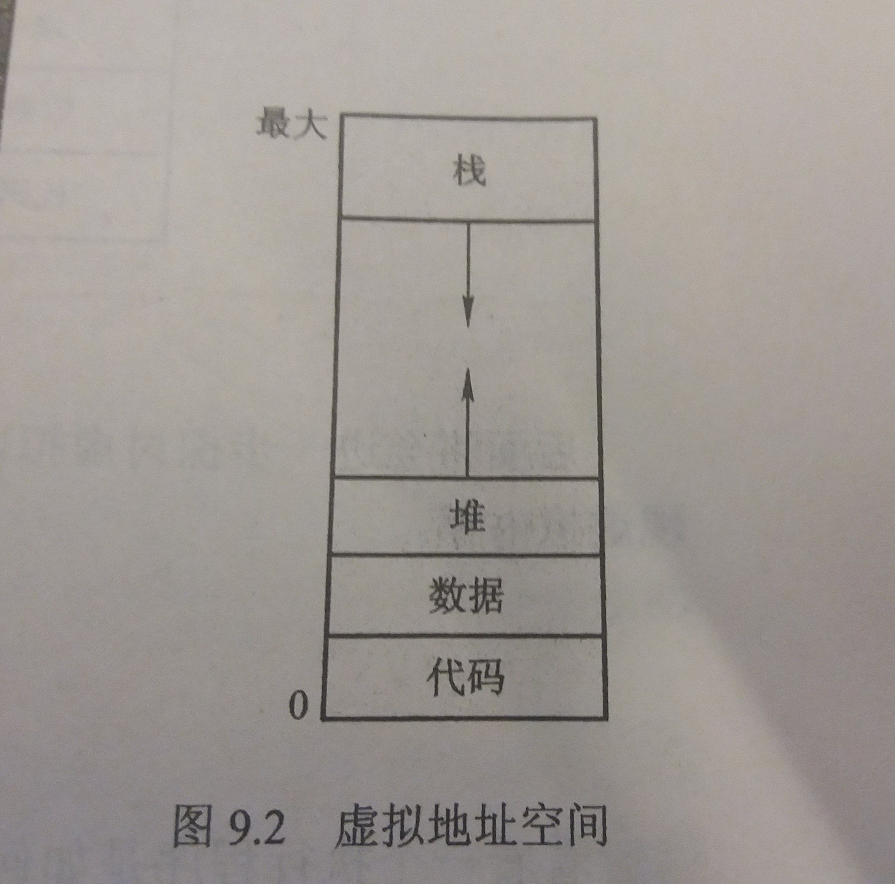

## 第9章 虚拟内存(virtual memory)
---
- 虚拟内存技术允许执行进程不必完全在内存中

- 虚拟内存将内存抽象为一个巨大的、统一的存储数组，进而将用户看到的逻辑内存与物理内存分开

- 优点
    - 允许程序员不受内存存储的限制
    - 共享文件和地址空间比较容易

- 缺点
    - 使用不当时大大降低性能
---
### 9.1 背景
---
- 第8章的内存管理算法的一个基本要求：执行指令必须在物理内存中

- 事实上，在许多情况下，并不需要将整个程序放到内存中

- 能够执行只有部分在内存中的程序的好处
    - 程序不再受现有的物理内存空间的限制
    - 每个用户程序使用更少的物理内存，所以更多的程序可以同时执行
    - 由于载入或交换每个用户程序到内存内所需的I/O会更少，用户程序运行的更快

- 虚拟内存将用户逻辑内存与物理内存分开

- 虚拟地址空间
    - 定义：进程如何在内存中存放的逻辑视图
    - 该视图为从某一逻辑地址开始连续存放
    - 如图
    

- 稀地址空间
    - 定义：包括空白的虚拟地址空间
    - 功能
        - 允许动态内存分配，堆可向上生长
        - 允许随着子程序的不断调用，栈可向下生长
    - 优点
        - 随着程序的执行，栈或堆的生长或需要载入动态链接库时，这些空白可以填充
        - 只有在堆与栈生长时，才需要实际的物理页

- 虚拟内存关于共享的优点
    - 通过将共享对象映射到虚拟地址空间上，**系统库**可为多个进程共享。虽然每个进程都认为共享库是其虚拟地址空间的一部分，但是共享库所用的物理内存的实际页是为所有进程所共享的
    - 虚拟内存允许进程 **共享内存**。允许一个进程创建内存区域，以便与其他进程共享，共享该内存区域的进程认为它是其虚拟地址空间的一部分，事实上这部分是共享的
    - 虚拟内存允许在用系统调用 `fork()` **创建进程**期间共享页，从而加快进程创建
---
&copy; 2018 T0UGH. All rights reserved.