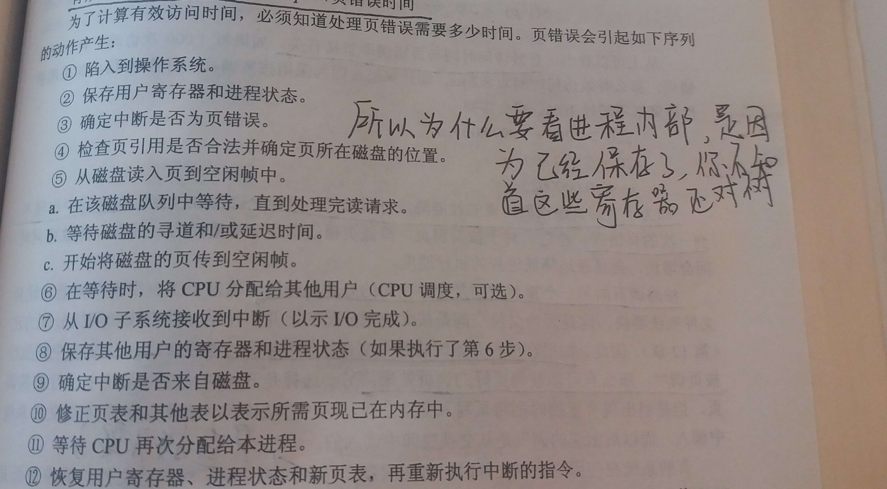

### 9.2 按需调页
---

- 按需调页
    - 只有程序执行需要时才载入页
    - 那些从未访问的页不会调入物理内存
    - 常为虚拟内存系统所使用

- 懒惰交换
    - 当需要页时，才将它换入内存
    - 而不是将整个进程换入内存

- 交换程序与调页程序
    - 交换程序对整个进程进行操作
    - 调页程序只是对进程的单个页进行操作

---
#### 9.2.1 基本概念

- 基本概念
    - 当换入进程时，调页程序推测在该进程再次换出之前会用到哪些页
    - 调页程序避免了读入那些不使用的页，也减少了交换时间和所需的物理内存空间

- 有效-无效位（valid-invalid bit）
    - 当该位置为“有效”时，该值表示相关的页既合法又在内存中
    - 当该位置为“无效”时，该值表示相关的页为无效，或者有效但不在内存中

- 页错误陷阱（page-fault trap）
    - 定义：对标记为无效的访问会产生页错误陷阱
    - 处理页错误陷阱
        1. 检查进程的内部页表，以确定该引用是合法还是非法的地址访问
        2. 如果引用非法，终止进程。如果引用有效但是尚未调入页面，那么现在调入
        3. 找到一个空闲帧
        4. 调度一个磁盘操作，以便将所需要的页调入刚分配的帧
        5. 当磁盘读操作完成后，修改进程的内部表和页表，以表示该页已在内存中
        6. 重新开始因陷阱而中断的指令，进程现在能访问所需的页，就好像它似乎总在内存中

- 纯粹按需调页
    - 定义：所有页都不在内存中，就开始执行进程

- 硬件支持
    - 页表：能通过有效-无效位，将条目设为无效
    - 次级存储器：用来保存不在内存中的页

- 请求调页的关键要求是能够在页错误后重新执行指令。在出现页错误时，保存中断进程的状态，必须能够按完全相同的位置和地址重新执行进程，只不过现在所需要的页已在内存中且可以访问
---
#### 9.2.2 按需调页的性能

- 有效访问时间（effective access time）
    - 公式：有效访问时间=(1-p)*ma+p*页错误时间
    - p：页错误的概率
    - ma：内存访问时间

- 页错误处理动作

- 页错误率
    - 页错误产生的概率(0~1)
    - 有效访问时间与页错误率直接相关
    - 页错误率高会显著降低性能
    - 为了让因页错误而出现的性能降低可以接受，只能允许每399990次访问中出现不到一次页错误

- 交换空间
    - 快速磁盘
    - 如果在进程开始时将整个文件镜像复制到交换空间，并从交换空间执行按页调度，那么可能获得更好的调页效果

---
&copy; 2018 T0UGH. All rights reserved.