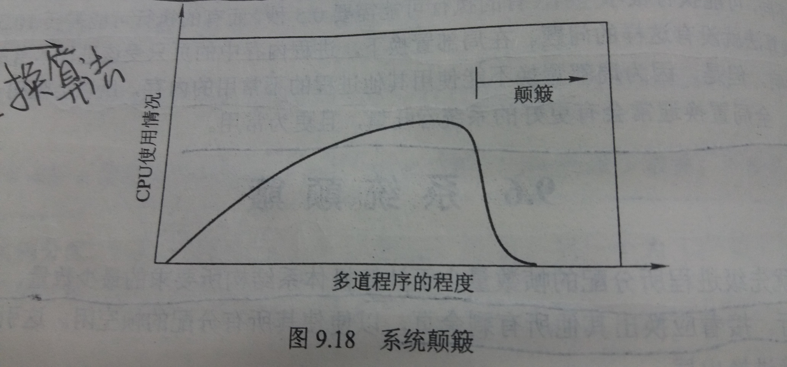

### 9.6 系统颠簸(thrashing)
---

- 解释系统颠簸
    - 如果进程没有它所需要的活跃使用的帧，那么它会很快产生页错误
    - 然而，其所有页都很活跃，它置换一个页，但又立刻用到这个页
    - 因此它一而再地产生页错误
    - 上述这种频繁的页调度行为称为颠簸
    - 如果一个进程在换页上用的时间要多于执行时间，那么这个进程就在颠簸
---
#### 9.6.1 系统颠簸的原因
- 系统颠簸所导致的严重性能问题
    - 前提
        - 如果CPU使用率过低，那么操作系统会引入新进程
        - 此操作系统使用全局置换算法
    - 步骤
        1. 一个进程请求更多的帧
        2. 它出现页错误，并从其他进程中拿到帧；这些进程也需要这些页，也从其他进程中拿到帧
        3. 然后这些进程开始排队等待换页，使就绪队列变小，CPU使用率降低
        4. CPU调度程序发现CPU使用率降低，会增加多道程序的程度
        5. 此时出现恶性循环，循环2、3、4步，导致系统调入更多的进程，每个进程拥有更少的帧，产生更多的页错误
        6. CPU使用率不断降低，出现系统颠簸，最终系统一个工作也完成不了
    - 系统颠簸图
    
    随着多道程序程度增加，CPU使用率增加，直到达到最大值，如果多道程序的程度还要继续增加，那么系统颠簸就开始了，且CPU使用率急剧下降

- 局部置换算法（local replacement algorithm）
    - 原理：如果一个进程颠簸，它不能从其他进程拿到帧，且不能使其他进程也颠簸
    - 问题
        - 由于调页设备的更长的平均队列，页错误的平均等待时间也会增加
        - 即使对没有颠簸的进程，其有效访问时间也会增加

- 局部模型
    - 对局部的解释
        - 局部是一个经常使用页的集合
        - 当进程执行时，它从一个局部移向另一个局部
        - 一个进程通常由多个不同局部组成，它们可能重叠
    - 例子
        - 当一个子程序被调用时，它就定义了一个新局部
        - 在这个局部中，内存引用包括该子程序的指令、其局部变量和全局变量的子集
        - 当该子程序退出时，因为子程序的局部变量和指令现已不再使用，进程离开该局部
        - 也可能在后面再次返回该局部
    - 局部与系统颠簸
        - if (为每个进程都分配了可以满足其当前局部的帧)
            - 接着它不再会出现页错误直到它改变局部为止
        - else if (分配的帧数少于现有局部的大小)
            - 进程会颠簸
            - 这是因为它不能将所有经常使用的页放在内存中
---
#### 9.6.2 工作集合模型

- `Δ`：一个int值，表示工作集合窗口的大小

- 工作集合窗口
    - 一个移动的窗口
    - 始终存储最近 `Δ` 个页的引用
    - 每次引用时，都会增加新引用，而最老的引用会丢失

- 工作集合
    - 从工作集合窗口中找出所有非重复的页就构成工作集合
    - 如果一个页在工作集合窗口内被引用过，那么它就处于工作集合中
    - 工作集合是对程序局部的近似

- 例子

- 如何根据工作集合判断系统是否处于颠簸
    1. 计算所有进程的工作集合的大小并求和得到 `D`
    2. 假设总的可用帧数为 `M`
    3. 如果 `D > M` ，那么有的进程得不到足够的帧，从而产生系统颠簸

- 如何使用工作集合模型来防止系统颠簸
    1. 操作系统跟踪每个进程的工作集合，并为进程分配大于其工作集合的帧数
    2. 如果还有空闲帧，那么可以启动另一进程
    3. 如果所有工作集合之和的增加超过了可用帧的总数，那么操作系统会挂起一个进程
    4. 该进程的页被写出，且其帧可以分配给其他进程
    5. 挂起的进程可以在以后重启
---
#### 9.6.3 页错误频率

- 页错误频率(page-fault frequency,PFF)

- 颠簸具有高的页错误频率

- 当页错误率太高时，进程需要更多的帧；如果页错误率太低，那么进程可能有太多的帧

- 通过页错误频率来控制系统颠簸
    - 为所期望的页错误率设置上限和下限
    - 如果实际页错误率超过上限，则分配更多帧
    - 如果实际页错误率低于下限，则从进程中移走帧
    - 如果页错误增加且没有可用帧，则必须选择一个进程暂停
---
&copy; 2018 T0UGH. All rights reserved.